# AI Close Copilot

A full-stack prototype that explores an AI-powered command center for bookkeeping firms — built to answer the daily question every practice manager faces:

> **"Which of my clients should I worry about right now, and why?"**

Built as a monorepo using the same stack Double uses in production: React, Redux Toolkit, TanStack Query, Express, TypeORM, and PostgreSQL, with Anthropic Claude for AI-powered transaction intelligence.

🌐 **[Live Demo](http://doublehq-copilot-frontend-demo.s3-website-us-east-1.amazonaws.com/)** · 📄 **[Research & Product Analysis](docs/RESEARCH.md)**

---

## ⚠️ Disclaimers

- **This is a demo, not production software.** Built in ~2 days as a technical assessment. It is not intended for real client use.
- **All data is synthetic.** Client names, transactions, and team members are AI-generated or hardcoded for demonstration purposes. No real financial data is used.
- **AI features require an API key** and incur costs per call. The app works without one via deterministic fallbacks, but AI-powered features (categorization, flagging, insights) will use template/heuristic responses instead.
- **Not affiliated with Double.** This is an independent prototype inspired by Double's product space. It does not use Double's code, APIs, or proprietary information.
- **Security is demo-grade.** JWT auth is implemented but secrets, rate limiting, and hardening are not production-ready.

---

## Table of Contents

- [Context & Motivation](#context--motivation)
- [What This Prototype Does](#what-this-prototype-does)
- [Key Features](#key-features)
- [Architecture](#architecture)
- [Tech Stack](#tech-stack)
- [AI Integration](#ai-integration)
- [Data Model](#data-model)
- [Testing](#testing)
- [Quick Start](#quick-start)
- [Scripts](#scripts)
- [Infrastructure](#infrastructure)
- [Product Thinking & Research](#product-thinking--research)
- [Research & Product Analysis](docs/RESEARCH.md)

---

## Context & Motivation

I read Double's help center, changelog, user reviews on G2 and Capterra, Canny feature requests, and the Series A announcement.

This prototype demonstrates a multi-client visibility layer: a dashboard that aggregates close health across all clients, surfaces risk factors, and uses AI for transaction categorization and anomaly detection.

**To be clear:** this is a simplified demo with mock data. Double's actual product is vastly more sophisticated — handling real QBO/Xero integrations, multi-firm multi-tenant architecture, and battle-tested workflows serving thousands of firms. This prototype simply demonstrates how I'd approach a problem like this using the same technologies.

---

## Screenshots

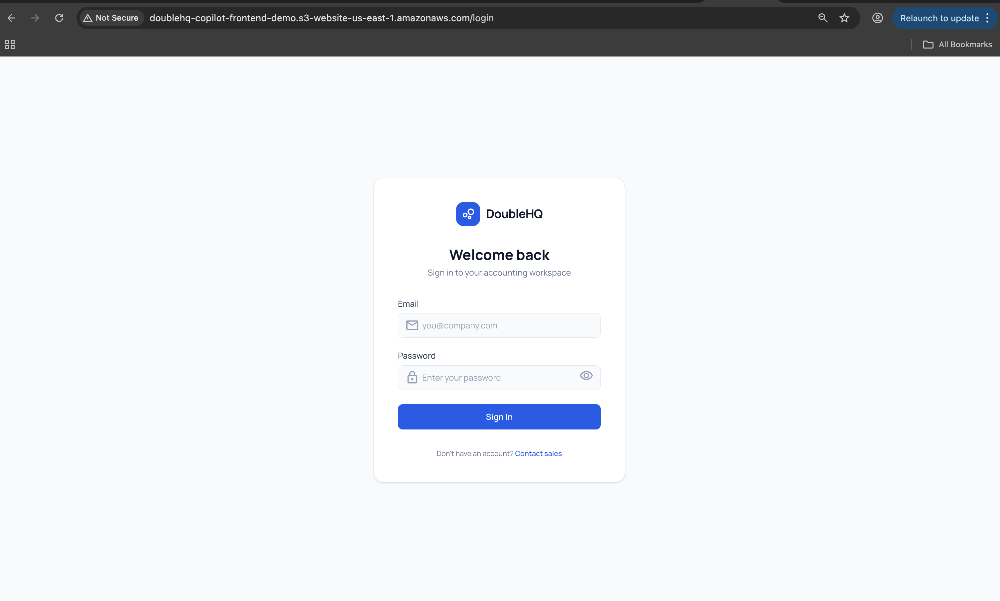
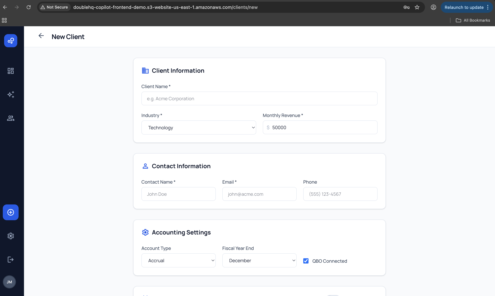
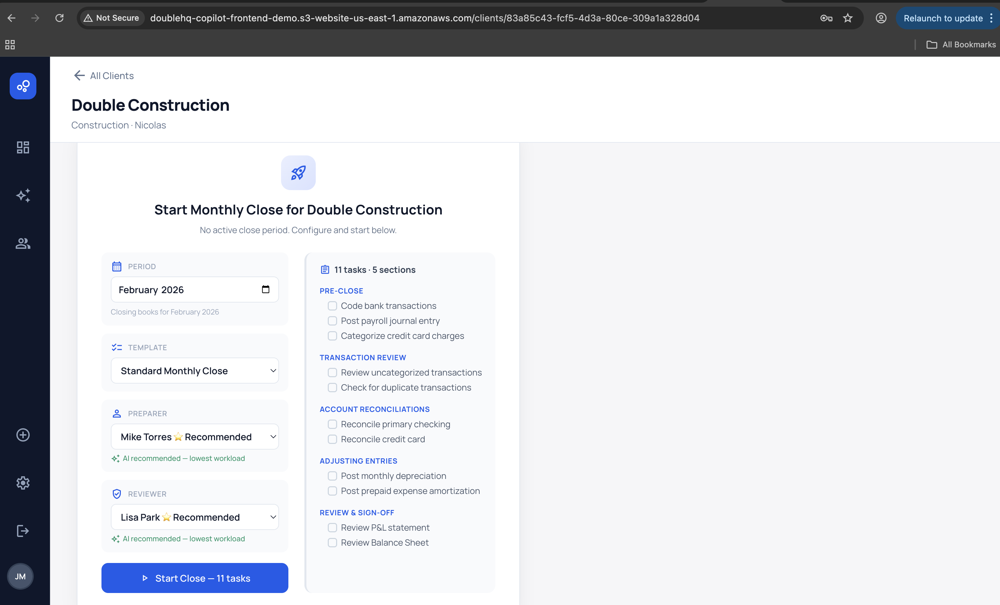
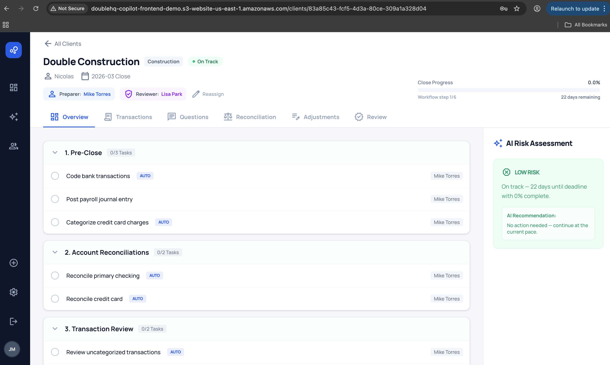
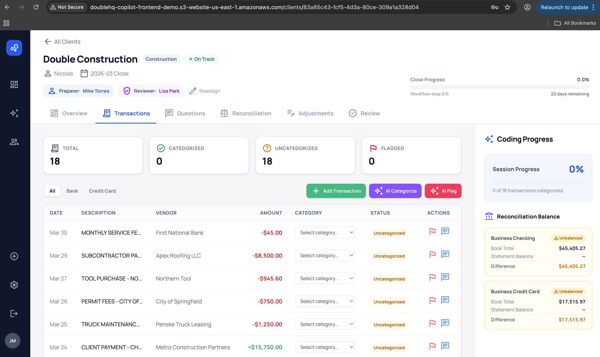
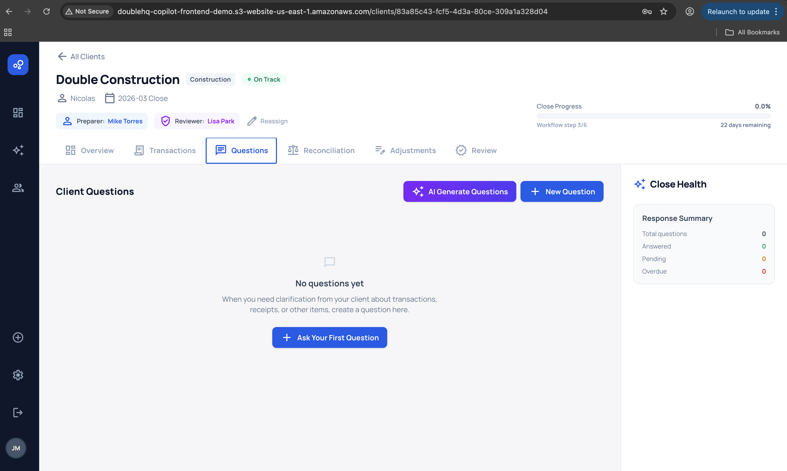
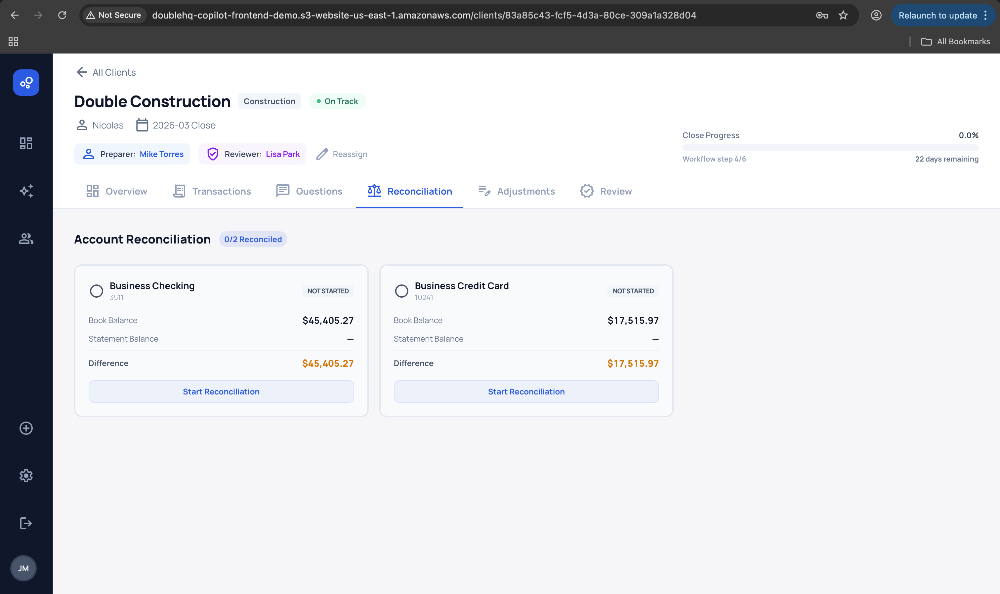
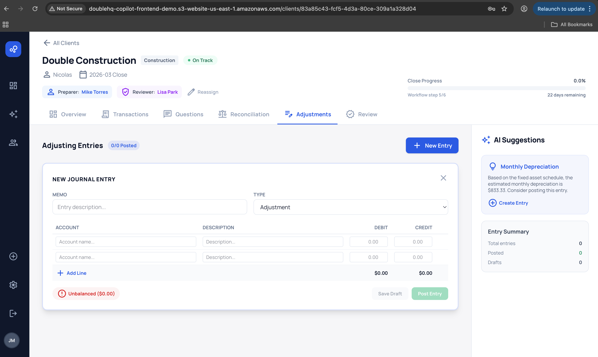
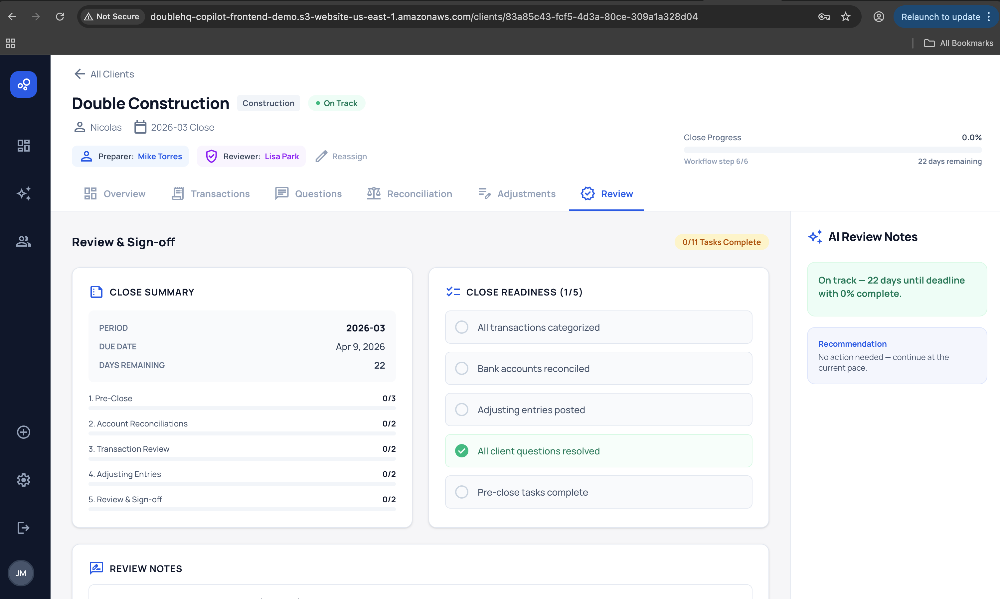
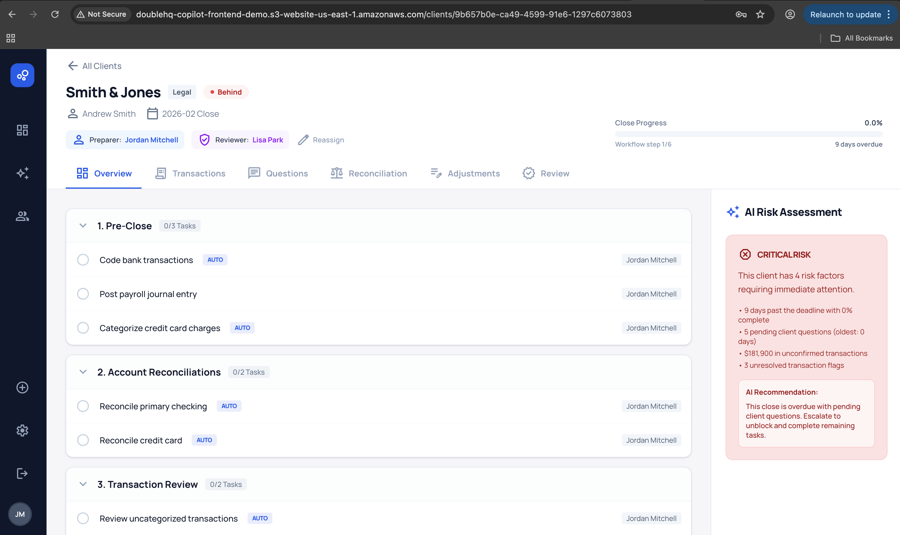
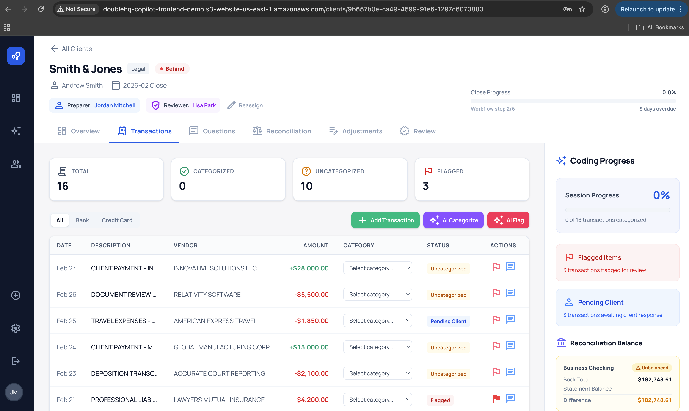
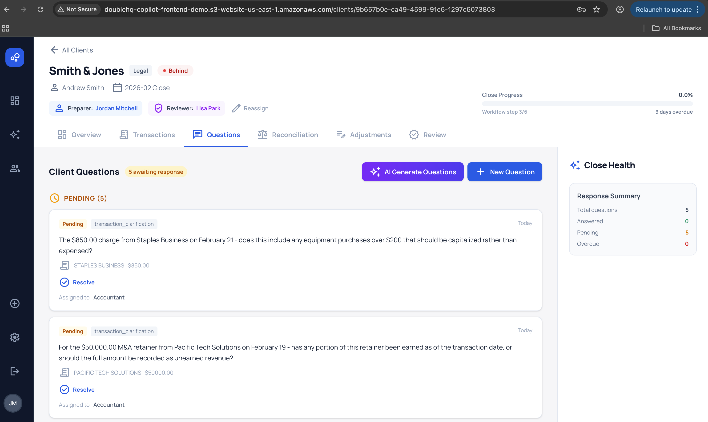
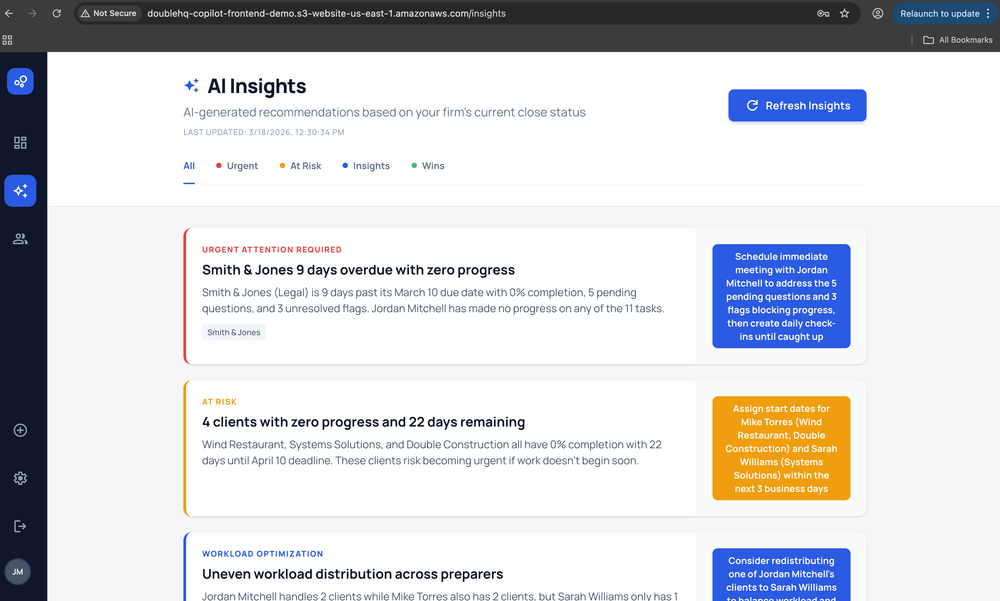
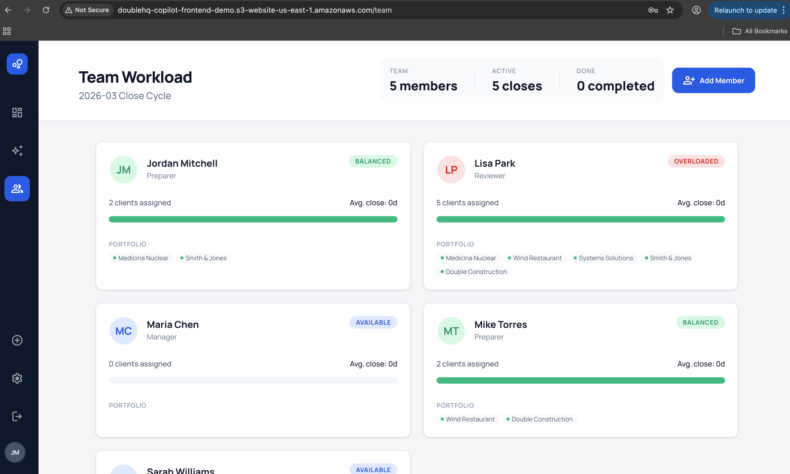

### 📊 Firm Overview Dashboard

A single screen showing all clients and their close health status. Each client is a card with a health badge (On Track / At Risk / Behind), progress bar, days remaining, and assigned team members.

### 🤖 AI Insights Panel

AI-generated natural-language insights about the firm's current state, categorized by urgency (Urgent, At Risk, Insight, Win). Each insight includes a description, affected client, and recommended action. Insights are generated via a structured prompt sent to the LLM with pre-computed metrics — the AI narrates, it never calculates.

### 📋 Client Close Detail

Clicking a client navigates to a 6-tab close management view:

| Tab | What it does |
|---|---|
| **Overview** | Task checklist across 5 workflow sections, manual checkboxes, progress tracking, AI risk sidebar |
| **Transactions** | Bank & credit card transactions with AI categorization, flagging, and question generation |
| **Questions** | Client questions sent/received, resolution workflow |
| **Reconciliation** | Bank statement matching with difference tracking |
| **Adjustments** | Journal entries (correction, adjustment, recurring, depreciation) with debit/credit balancing |
| **Review & Sign-off** | AI review notes, risk assessment, recommendation, sign-off action |

### 👥 Team Workload

Team member cards showing client assignments, on-track/at-risk/behind breakdowns, capacity indicators

---

## Key Features

### AI Transaction Categorization

Transactions can be categorized by Claude with confidence scores. The AI receives the transaction details plus the system's chart of accounts categories, and returns a category suggestion. A deterministic fallback uses vendor keyword matching when the API is unavailable.

### AI Transaction Flagging

Claude scans transactions to identify suspicious items.

### AI Question Generation

The AI generates professional clarification questions for transactions needing client input. Questions reference specific amounts, dates, and vendors. All non-pending transactions are sent to Claude, which selects the 3–5 most ambiguous ones to ask about.

### Health Score Algorithm

A weighted numeric score (0–100) computed from 5 dimensions:

| Dimension | Weight | What it measures |
|---|---|---|
| Task Progress | 35% | Completed / total tasks |
| Time Pressure | 25% | Days remaining vs. total window; 0 when overdue |
| Blocking Issues | 20% | Pending client questions + critical flags (−20 pts each) |
| Client Responsiveness | 10% | Average wait time on pending questions |
| Historical Comparison | 10% | Current pace vs. previous close times |

Score maps to status: ≥75 = On Track (green), 50–74 = At Risk (amber), <50 = Behind (red).

### Close Workflow with Auto-Complete

Each close has 11 tasks across 5 sections (Pre-Close, Reconciliation, Transaction Review, Adjustments, Review & Sign-off). Some tasks auto-complete when work is done in other tabs — for example, categorizing all bank transactions marks the "Code bank transactions" task as complete. Manual tasks are simple checkboxes.

### Risk Assessment & Recommendation Engine

The client detail page builds a factor-based risk assessment from: overdue status, pending questions, unresolved flags, blocked tasks, and deadline proximity. A recommendation engine evaluates conditions in priority order and returns the most important next action.

---

## Architecture

### Clean Architecture

The backend follows Clean Architecture with strict dependency rules — each layer depends only on layers inward from it.

```
┌──────────────────────────────────────────────────────────┐
│                    PRESENTATION                          │
│    Express Routes  │  Middleware  │  Zod Validation       │
├──────────────────────────────────────────────────────────┤
│                    INFRASTRUCTURE                        │
│    TypeORM Repos  │  Claude AI Services  │  Config        │
├──────────────────────────────────────────────────────────┤
│                    APPLICATION                           │
│    Use Cases (23)  │  Prompt Building                     │
├──────────────────────────────────────────────────────────┤
│                      DOMAIN                              │
│   Entity Interfaces  │  Port Interfaces  │  Services      │
│   (health-score, close-status, ai-data-generator)        │
└──────────────────────────────────────────────────────────┘
           ▲ Dependencies point INWARD only ▲
```

### Monorepo Structure

```
doublehq-copilot/
├── packages/
│   ├── api/                    # Express backend
│   │   ├── src/
│   │   │   ├── domain/             # Entity & port interfaces, business services
│   │   │   ├── application/        # 23 use cases (one per operation)
│   │   │   ├── infrastructure/     # TypeORM entities (15), repos, Claude adapters, seeds
│   │   │   └── presentation/       # Routes, middleware, Zod validation schemas
│   │   └── tests/
│   │       ├── integration/        # 10 test files (Testcontainers + real Postgres)
│   │       └── unit/               # 6 test files (pure function tests)
│   │
│   ├── web/                    # React frontend
│   │   └── src/
│   │       ├── pages/              # Dashboard, ClientDetail, Insights, Team, Login
│   │       ├── pages/tabs/         # 6 tabs (Overview, Transactions, Questions, etc.)
│   │       ├── hooks/              # TanStack Query queries & mutations
│   │       ├── store/              # Redux Toolkit slices
│   │       ├── components/         # Shared UI components
│   │       └── utils/              # Extracted pure business logic
│   │
│   └── shared/                 # Cross-package types, enums, structured logger
│
├── infra/                      # Terraform IaC (AWS: ECS, RDS, S3, ECR, VPC)
├── docs/                       # Additional documentation
└── docker-compose.yml          # Local Postgres
```

### Key Design Decisions

| Decision | Rationale |
|---|---|
| **Clean Architecture** | Domain logic has zero knowledge of Express, TypeORM, or Claude. Use cases depend only on port interfaces. Swapping Claude for OpenAI (or a fallback) requires changing one adapter file. |
| **Manual DI in `main.ts`** | The composition root wires ~25 dependencies by hand — transparent, no magic framework. A DI container would make sense past 50+ services. |
| **AI as Writer, Not Calculator** | Health scores, metrics, and risk factors are pre-computed in pure domain functions. The AI receives structured data and generates narrative — it never calculates raw numbers. This prevents hallucinated metrics. |
| **Fallback Strategy** | Every AI call has a deterministic fallback (vendor keyword matching, heuristic flagging, template-based insights) so the app works without an API key. |
| **Redux + TanStack Query** | Redux manages client-side UI state (filters, active tab, workflow). TanStack Query manages server state (API data with caching and invalidation). Different concerns, clear separation. |
| **Query Key Factories** | `clientKeys.detail(id)`, `clientKeys.transactions(id)` — idiomatic cache management with selective invalidation after mutations. |
| **Zod Validation** | Request bodies validated at the presentation layer with Zod schemas, keeping validation separate from business logic. |

---

## Tech Stack

| Layer | Technology |
|---|---|
| **Frontend** | React 18, TypeScript, Vite, TanStack Query, Redux Toolkit, React Router |
| **Backend** | Node.js, Express, TypeORM, PostgreSQL |
| **AI** | Anthropic Claude — transaction categorization, flagging, question generation, insights |
| **Shared** | TypeScript types, enums, and structured logger (npm workspace package) |
| **Testing** | Jest, Testcontainers (integration tests against real Postgres) |
| **Infrastructure** | Docker Compose (local), Terraform (AWS: ECS Fargate, RDS, S3, ECR) |
| **Validation** | Zod schemas for request validation |

This stack was chosen specifically to match what Double uses in production (React, Redux Toolkit, TanStack Query, Express, TypeORM, PostgreSQL) based on the job posting requirements.

---

## AI Integration

### Three AI-Assisted Systems

The prototype has three distinct AI-assisted systems:

1. **Health Score** — A pure deterministic algorithm (no LLM). Computes a 0–100 score from task progress, time pressure, blocking issues, client responsiveness.

2. **Risk Assessment** — A rule-based engine that scans for risk factors (overdue + incomplete, pending questions, unresolved flags, blocked tasks, deadline pressure) and generates human-readable summaries.

3. **AI Transaction Intelligence** — Claude-powered features for categorization, flagging, and question generation.

### Prompt Engineering Approach

The AI never sees raw database queries. Instead:

1. Backend pre-computes all metrics (days remaining, completion %, flag counts, question ages)
2. A structured prompt is built with these computed facts
3. Claude receives the prompt and generates narrative/analysis
4. Response is parsed and cached

This approach controls for hallucinated numbers, reduces token usage (sending computed summaries instead of raw data), and makes the AI's output predictable.


### Production Considerations

These aren't implemented in the demo, but documented as areas I'd address in production:

- **Cost control** — Pre-computing metrics server-side minimizes prompt size. At scale, event-driven insight generation (on state change) would replace on-demand calls.
- **Caching** — Cache invalidation on meaningful state change rather than TTL-based expiry.

---

## Testing

**16 test suites** across integration and unit tests.

### Integration Tests (10 suites)

Run against a real PostgreSQL instance via Testcontainers — each test run gets a fresh database with migrations applied.

| Test | What it validates |
|---|---|
| Close lifecycle | Start close → tasks created from template → progress tracking |
| Categorize & auto-complete | Categorize transactions → auto-complete related tasks |
| Sign-off | Sign-off flow → close status update → task completion |
| Journal entry workflow | Create entry → add lines → post → validate balance |
| Transaction flagging | Flag/unflag transactions → status updates |
| Reconciliation | Mark accounts reconciled → auto-complete tasks |
| Questions & tasks | Ask question → resolve → auto-complete task |
| Create client | Client creation with validation |
| Full close E2E | End-to-end close from start to sign-off |
| Adjust transaction | Transaction adjustment workflow |

### Unit Tests (6 suites)

Pure function tests with no database or external dependencies.

| Test | What it validates |
|---|---|
| Health score service | Score computation across all 5 dimensions, edge cases |
| Close status service | Status derivation logic (overdue, deadline proximity) |
| Dashboard health overrides | Real-time health recalculation for dashboard display |
| Journal entry balance | Debit/credit balance validation |
| Capacity & risk | Team capacity calculations, risk factor detection |
| Validation schemas | Zod schema validation for API request bodies |

### Running Tests

```bash
npm test                            # All backend suites (needs Docker for Testcontainers)
npm run test:unit                   # Unit tests only (no Docker needed)
npm run test:integration            # Integration tests only
```

---

## Quick Start

### Prerequisites

- **Node.js** 20+
- **Docker** (for local PostgreSQL)

### Setup

```bash
# 1. Clone and install
git clone <repo-url>
cd doublehq-copilot
npm install

# 2. Configure environment
cp .env.example .env
# Edit .env — add your ANTHROPIC_API_KEY (optional; fallbacks work without it)
# Set SEED_DEFAULT_PASSWORD for demo user login

# 3. Start everything: database → migrations → seed → dev servers
npm run setup
npm run dev
```

**App:** `http://localhost:5173` · **API:** `http://localhost:3001`

Demo user credentials are created by the seed script — the login screen will display them.

---

## Scripts

| Command | Description |
|---|---|
| `npm run dev` | Start API + web dev servers concurrently |
| `npm run setup` | Docker up → run migrations → seed database |
| `npm run build` | Build all packages for production |
| `npm test` | Run the full test suite (requires Docker) |
| `npm run test:unit` | Run unit tests only |
| `npm run test:integration` | Run integration tests only |
| `npm run seed` | Re-seed the database with demo data |
| `npm run migration:run` | Run pending TypeORM migrations |
| `npm run migration:generate` | Generate a new migration from entity changes |

---

## Infrastructure

### Local Development

Docker Compose provides PostgreSQL for local development. `npm run setup` handles everything: starts the database container, runs migrations, and seeds demo data.

### AWS Deployment

The `infra/` directory contains Terraform configuration for deploying to AWS:

| Resource | Purpose |
|---|---|
| **ECS Fargate** | Container orchestration for the API |
| **RDS PostgreSQL** | Managed database |
| **S3** | Frontend static hosting |
| **ECR** | Container image registry |
| **VPC** | Network isolation with public/private subnets |
| **Secrets Manager** | Secure storage for API keys and database credentials |
| **IAM** | Least-privilege roles for ECS tasks |

---

## Product Thinking & Research

### Research Process

Before writing code, I studied Double's ecosystem:

- **Changelog (Dec 2025 – Mar 2026)** — tracked 11 releases to understand investment priorities. The heavy focus on AI features (AI Expenses, AI Reasoning, AI Bank Feed improvements) informed the decision to build an AI-integrated feature.
- **User reviews (G2, Capterra)** — identified pain points around multi-client visibility and project status tracking.
- **Canny feature requests** — noted that Client Portal & Communications (805 requests) and Workflow/Task Management (756 requests) are the highest-volume categories.

### Why an AI Close Copilot

The AI component was included because it aligns with Double's investment direction, and the job posting lists "AI agents in production" as a nice-to-have.

### How This Would Fit Into Double's Real Architecture

If this were a real feature, it would likely:

- **Aggregate from existing entities** — Double already has close workflows, tasks, and client questions. The health score would be a new service layered on top, not a separate data model.
- **Use event-driven insight generation** — instead of on-demand LLM calls, insights would regenerate when meaningful state changes occur (task completed, deadline passed, question answered).
- **Leverage the existing design system** — the prototype uses its own styling, but a real implementation would use Double's component library and design tokens.
- **Integrate with existing notifications** — "this client is behind" should surface in the same notification channels the team already uses.

### What I'd Improve With More Context

- Access to Double's actual data model would inform a more accurate health score algorithm
- Understanding the existing notification system would help integrate alerts
- Real QBO/Xero transaction data would make AI categorization more representative
